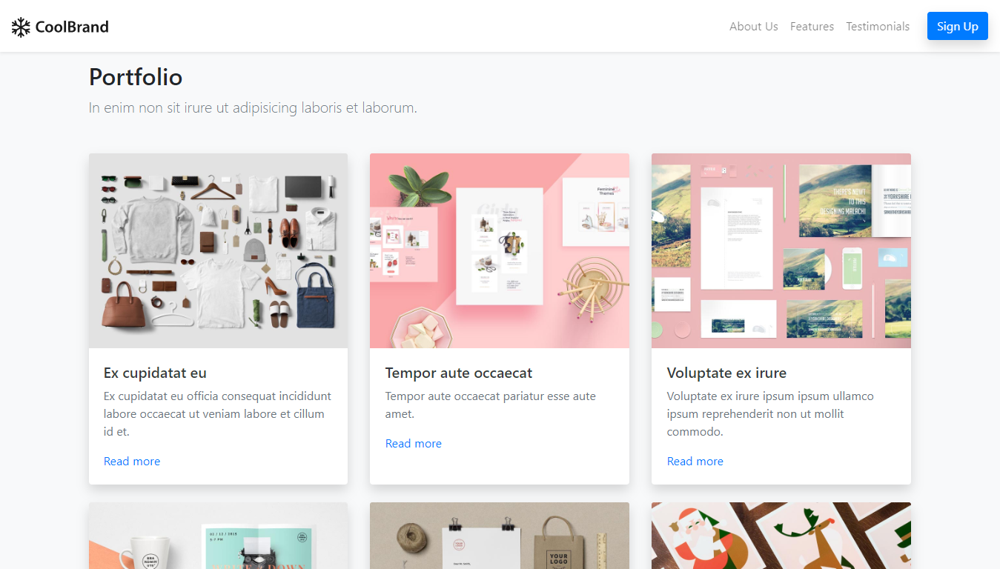

# Bootstrap Basic Landing Page

> A basic portfolio landing page. The website is built with the Bootstrap 4 framework.



  &nbsp;&nbsp;
 &nbsp; &nbsp;

## Table of contents

- [Bootstrap Basic Landing Page](#bootstrap-basic-landing-page)
  - [Table of contents](#table-of-contents)
  - [General info](#general-info)
  - [Technologies](#technologies)
  - [Installation and Usage](#installation-and-usage)
    - [Dev Mode](#dev-mode)
    - [Prod Mode](#prod-mode)
    - [Live Demo](#live-demo)
  - [Status](#status)
  - [Contact](#contact)

## General info

This template provides a  a basic & nice responsive page that can be a good starting point in which to build your projects upon, be it for your portfolio, company website or a landing page providing you with a basic starter structure. 

## Technologies

- HTML5
- CSS3 / SCSS
- Bootstrap 4

## Installation and Usage

Prerequisites: [Node.js](https://nodejs.org/en/) 14.3.0.

To run this project:

- Clone this repo to your local machine using

```shell
$ git clone https://github.com/francislagares/bootstrap-basic-landing-page
```

- Switch into directory

```shell
$ cd bootstrap-basic-landing-page
```

- Install dependencies

```shell
$ yarn install
```

### Dev Mode

- Run server

```shell
$ yarn start
```

- Browser will open automatically at http://localhost:3000

### Prod Mode

- Make a build

```shell
$ yarn build
```

- Run Express Server

```shell
$ yarn serve
```

- Open http://localhost:3000 in your browser.

### Live Demo

You can see the application running
[here.](https://francislagares.github.io/bootstrap-basic-landing-page/)


## Status

Currently: _finished_.

## Contact

Created by [@francislagares](https://www.linkedin.com/in/francislagares/) - feel free to contact me!
